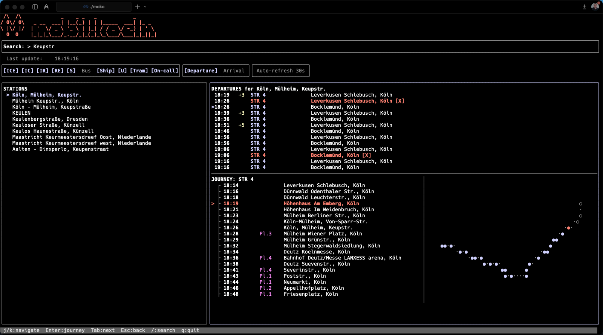

# moko

<p align="center">
  
</p>

Command-line interface for Deutsche Bahn real-time transit information.

## Features

- 🚆 Interactive TUI with live updates
- 📊 Departure & arrival boards
- 🗺️ Journey details & station search
- 🚃 Train formation (Wagenreihung)
- 🔍 Filter by transport modes
- 📝 JSON output for scripting
- ⚡ Response caching

## Installation

**Homebrew:**

```bash
brew install mobil-koeln/tap/moko
```

**From source:**

```bash
go install github.com/mobil-koeln/moko-cli/cmd/moko@latest
```

**Docker:**

```bash
docker build -t moko .
docker run --rm moko search "Köln-Ehrenfeld"
```

## Usage

### Interactive TUI Mode

Launch the interactive terminal UI (default):

```bash
moko
# or explicitly: moko tui
```

**TUI Features:**

- Real-time departure/arrival boards with auto-refresh
- Station search with instant results
- Filter by transport modes (ICE, IC, RE, S-Bahn, etc.)
- Journey details with route visualization
- Keyboard navigation (Tab, Arrow keys, Enter)
- Color-coded delays (green=on-time, yellow=minor, red=major)

### CLI Mode

Use individual commands for scripting and automation:

```bash
# Search for stations
moko search "Köln-Ehrenfeld"
moko search "Keupstr." --json

# Show departures/arrivals
moko departures <eva>:<station_id>
moko arrivals <eva>:<station_id>

# Find nearby stations (latitude:longitude)
moko nearby 50.107:8.663

# Get journey details
moko journey <journey_id>

# Show train formation
moko formation 8000105 ICE 623
```

## Docker

**Build the image:**

```bash
docker build -t moko .
```

**Run CLI commands:**

```bash
docker run --rm moko search "Köln-Ehrenfeld"
docker run --rm moko search "Keupstr." --json
docker run --rm moko nearby 50.107:8.663
```

**Interactive TUI:**

```bash
docker run -it --rm moko tui
```

**With persistent cache:**

```bash
docker run --rm -v ~/.cache/moko:/home/moko/.cache/moko moko search "Keupstr."
```

## Options

**Common flags:**

- `-d, --date <date>` - Date (DD.MM.YYYY or YYYY-MM-DD)
- `-t, --time <time>` - Time (HH:MM)
- `-m, --modes <modes>` - Filter by transport modes (ICE, EC_IC, REGIONAL, SBAHN, etc.)
- `-v, --via` - Show intermediate stops
- `--json` - JSON output for scripting
- `--no-cache` - Disable response caching

**Examples:**

```bash
moko departures 8000105:... --modes ICE,EC_IC        # Only ICE/IC
moko departures 8000105:... -d 28.12.2025 -t 14:30   # Specific time
moko search "Frankfurt" --json | jq '.[0].name'      # JSON output
```

## Caching

API responses are cached to improve performance:

- **Location:** `~/.cache/moko/`
- **TTL:** 60 seconds (default)
- **Disable:** Use `--no-cache` flag
- **Clear cache:** `rm -rf ~/.cache/moko/`

The cache is shared between CLI and TUI modes.

## Transport Modes

Available modes for `--modes` filter:

| Mode       | Description              |
| ---------- | ------------------------ |
| `ICE`      | High-speed trains        |
| `EC_IC`    | EuroCity/InterCity       |
| `REGIONAL` | Regional trains (RE, RB) |
| `SBAHN`    | S-Bahn suburban trains   |
| `BUS`      | Buses                    |
| `UBAHN`    | U-Bahn subway            |
| `TRAM`     | Trams/Streetcars         |

**Example:** `--modes ICE,EC_IC,REGIONAL`

## Development

### Building

```bash
# Standard build
make build

# Build for specific platform
GOOS=linux GOARCH=amd64 make build

# With version info
go build -ldflags="-X main.version=0.1.0" -o moko ./cmd/moko
```

### Testing

The project uses Go's standard testing framework with comprehensive test coverage:

```bash
# Run all tests
make test

# Run tests with coverage report
make test-coverage

# Open HTML coverage report
open coverage.html

# Run short tests only (skip integration)
make test-short

# Check if coverage meets threshold (70%)
make coverage-check
```

### Linting

```bash
# Run golangci-lint
make lint

# Run with auto-fix
make lint-fix

# Run go vet only
make vet
```

**Install golangci-lint:**
```bash
brew install golangci-lint
# or
go install github.com/golangci/golangci-lint/cmd/golangci-lint@latest
```

**Test Coverage:**

- Overall target: 70%+
- Critical packages (api, models): 70%+
- Test utilities in `internal/testutil/`
- Mock HTTP server for API testing
- 100+ test cases across all packages

**Writing Tests:**

```go
import "github.com/mobil-koeln/moko-cli/internal/testutil"

func TestExample(t *testing.T) {
    testutil.AssertEqual(t, got, want)
    testutil.AssertNil(t, err)
}
```

### Releasing

Releases are automated via GitHub Actions and GoReleaser:

**Create a release:**

```bash
# Tag the version (semver)
git tag -a v0.1.0 -m "Release v0.1.0"
git push origin v0.1.0
```

**What happens automatically:**

1. GitHub Actions triggers on tag push
2. Runs tests and lint checks
3. Builds binaries for Linux, macOS, Windows
4. Creates GitHub release with binaries
5. Updates Homebrew tap (`mobil-koeln/homebrew-tap`)
6. Users can install with `brew upgrade moko`

**Requirements:**

- Semver tags (v0.1.0, v1.0.0, etc.)
- Passing CI tests
- GitHub tokens configured in Actions secrets

### Project Structure

```
moko-cli/
├── cmd/moko/           # CLI entry point
├── internal/
│   ├── api/            # API client & requests
│   ├── cache/          # Response caching
│   ├── models/         # Data models
│   ├── operators/      # Train operator mappings
│   ├── output/         # Terminal formatting
│   ├── testutil/       # Test utilities
│   └── tui/            # Bubble Tea TUI
├── .github/
│   └── workflows/      # CI/CD pipelines
├── CLAUDE.md           # AI assistant guide
└── README.md           # This file
```

## License

MIT License
